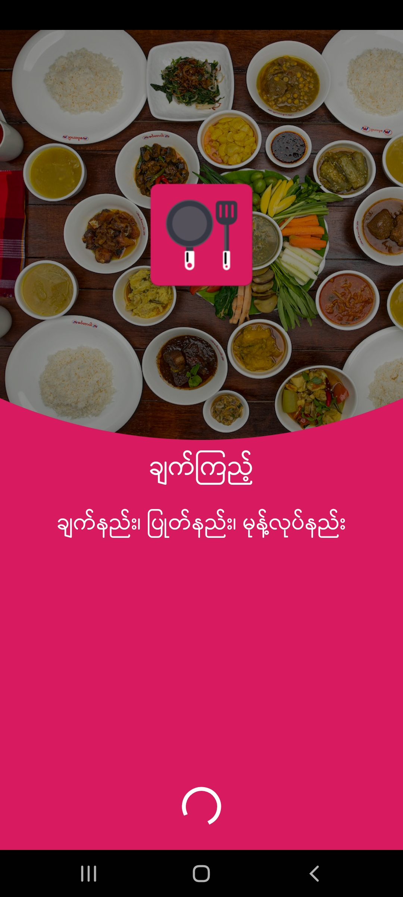
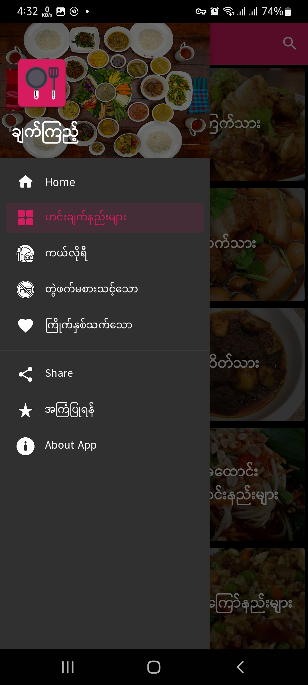

## EasyCooking

Food Recipes and Kitchen Help App Android project with Java, SQLite, Retrofit

## Tech Stack

- Java
- SQLite
- Retrofit & OkHttp3
- Gson
- Glide

[ချက်ကြည့် : EasyCooking](https://play.google.com/store/apps/details?id=com.proton.easycooking)
 

## Screenshots

